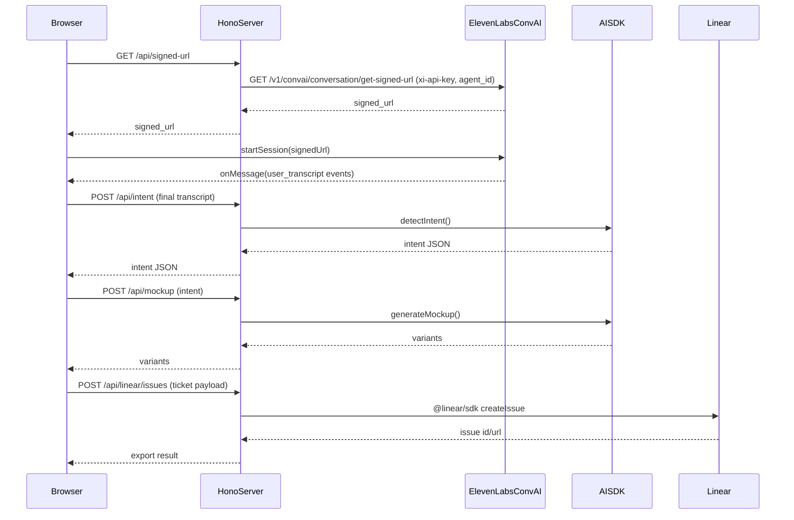

## Current (old) flow summary

- **Client mic + transcript**: [`client/src/hooks/useConversationTranscription.ts`](client/src/hooks/useConversationTranscription.ts) uses `@elevenlabs/react` `useConversation()` to connect to an **ElevenLabs ConvAI Agent**. It receives `user_transcript` and `agent_response` messages.
- **Auth**: client calls `fetchSignedUrl()` in [`client/src/lib/api.ts`](client/src/lib/api.ts), which hits `GET /signed-url` in [`server/src/index.ts`](server/src/index.ts). That endpoint calls ElevenLabs ConvAI signed-url: `GET /v1/convai/conversation/get-signed-url?agent_id=...` via [`server/src/services/elevenlabs.ts`](server/src/services/elevenlabs.ts).
- **Logic already in-repo**: intent + mockup generation are already backend-owned:
  - `POST /intent` → [`server/src/services/intentDetector.ts`](server/src/services/intentDetector.ts)
  - `POST /mockup` → [`server/src/services/mockupGenerator.ts`](server/src/services/mockupGenerator.ts)
- **Export**: ticket export currently calls `sendContextualUpdate()` (client → agent) and relies on an **ElevenLabs agent webhook tool** to create Linear issues.

## Target (new) flow

- **Keep ElevenLabs React client for voice + transcripts**: continue using `@elevenlabs/react` `useConversation()` with backend **signed-URL auth**, so the browser can connect to ElevenLabs without exposing the API key.
- **Remove agent-side “logic”**: no more agent webhook tools, no “agent decides to export”; the app decides and calls our backend.
- **Backend owns export**: create Linear issues directly from our backend via the Linear TypeScript SDK ([Linear SDK docs](https://linear.app/developers/sdk)).



## Implementation plan

### 1) Keep ElevenLabs React client for realtime transcripts (backend-authenticated)

- **Server**: keep a signed-url endpoint (via Hono) that:
  - calls ElevenLabs ConvAI `get-signed-url` using `xi-api-key` and `agent_id`
  - returns `{ signedUrl }` to the client (do not expose the API key)
- **Client**: keep using `@elevenlabs/react` `useConversation()` in [`client/src/hooks/useConversationTranscription.ts`](client/src/hooks/useConversationTranscription.ts), but:
  - treat `user_transcript` (and/or its nested transcription event) as the source of truth for *committed/final* transcript chunks — do **not** look for a `final` boolean/property on the payload; determine “final vs partial” from the event type / SDK semantics
  - trigger intent detection for **every committed user transcript message** (i.e., each time a new final chunk arrives, call `POST /api/intent` with that text)
    - it’s OK to debounce bursty updates, but the end behavior must still be: **1 intent call per user message**
  - optionally surface partial/pending transcript if available; otherwise keep showing “pending text” based on what the SDK provides
  - remove `sendContextualUpdate` and any reliance on agent tools/webhooks

**Key file touch points**

- Server:
  - Ensure [`server/src/index.ts`](server/src/index.ts) exposes signed-url under `/signed-url` so it’s reachable as `/api/signed-url` via Vite proxy.
  - Keep [`server/src/services/elevenlabs.ts`](server/src/services/elevenlabs.ts) as the signed-url wrapper.
- Client:
  - Update types in [`client/src/types/index.ts`](client/src/types/index.ts): stop assuming a `final` field exists on messages; derive “final vs partial” from the SDK event type / semantics. Treat `agent_response` as optional UI only (do not rely on it for app logic).
  - Update UI text in [`client/src/App.tsx`](client/src/App.tsx) header currently showing “ElevenLabs Agents”.

### 2) Keep intent + mockup pipeline (already backend-owned)

- Keep using existing endpoints and services:
  - `POST /intent` in [`server/src/index.ts`](server/src/index.ts) + [`server/src/services/intentDetector.ts`](server/src/services/intentDetector.ts)
  - `POST /mockup` in [`server/src/index.ts`](server/src/index.ts) + [`server/src/services/mockupGenerator.ts`](server/src/services/mockupGenerator.ts)
- Client already debounces `detectIntent()` and calls `generateMockup()` in [`client/src/App.tsx`](client/src/App.tsx). Only adjust if transcript event shapes change.

### 3) Migrate Linear export from agent tool → backend API (Linear TS SDK)

- Add a server endpoint like `POST /linear/issues` (proxied as `/api/linear/issues`) that creates an issue in Linear.
- Add a new service wrapper, e.g. [`server/src/services/linear.ts`](server/src/services/linear.ts), that uses the Linear TypeScript SDK ([docs](https://linear.app/developers/sdk)):
  - install `@linear/sdk` in `server/`
  - create a `LinearClient` with `apiKey`
  - create an issue with `teamId`, `title`, `description`, and optional `labelIds` / `projectId`
- Update client export logic:
  - Replace `sendContextualUpdate(...)` usage in [`client/src/App.tsx`](client/src/App.tsx) with a typed API call (new `exportToLinear()` in [`client/src/lib/api.ts`](client/src/lib/api.ts)).
  - Update ticket state transitions: `ready → exported` only after backend confirms success (and optionally store returned Linear URL).

#### Linear SDK notes (creating issues correctly)

Use the mutation flow described in [Linear “Fetching & modifying data → Mutations”](https://linear.app/developers/sdk-fetching-and-modifying-data#mutations).

- **You must provide a `teamId`**: Linear issues are always created in a team. Prefer `LINEAR_TEAM_ID` env; if you don’t have it, fetch teams once and select by key/name.
- **Handle mutation payloads**: `createIssue(...)` returns a payload with `success` and `issue`. Check `success` and return `issue.id` and `issue.url` to the client.
- **Descriptions are Markdown**: The `description` field is Markdown; include structured sections (“Context”, “Acceptance criteria”, etc.) to match our ticket payload.
- **IDs**: Most optional fields require IDs (`assigneeId`, `projectId`, `labelIds`, `stateId`, etc.). In the Linear app you can use the command menu and “Copy model UUID”.

Example server-side create (pseudo-code shape; adapt to our Hono handler/service):

```ts
import { LinearClient } from "@linear/sdk";

const linear = new LinearClient({ apiKey: process.env.LINEAR_API_KEY! });

// Option A: use env-provided team id
const teamId = process.env.LINEAR_TEAM_ID!;

// Option B (fallback): resolve team by key or name (do once / cache)
// const teams = await linear.teams();
// const team = teams.nodes.find(t => t.key === "ENG" || t.name === "Engineering");
// if (!team?.id) throw new Error("Unable to resolve Linear team id");
// const teamId = team.id;

const payload = await linear.createIssue({
  teamId,
  title,
  description, // Markdown
  // optional:
  // priority: 2,
  // assigneeId,
  // projectId,
  // labelIds,
});

if (!payload.success || !payload.issue) {
  throw new Error("Linear createIssue failed");
}

return { id: payload.issue.id, url: payload.issue.url };
```

If we need to create multiple issues or support search/selection:

- **Pagination**: connections (e.g. `linear.issues()`, `linear.teams()`) return `nodes` and `pageInfo`; use `fetchNext()` or `after: endCursor` per the SDK docs.
- **Ordering**: use the `orderBy` optional variable where supported (see Linear SDK pagination docs).

### 4) Practical transcript behavior

- Ensure we only trigger intent detection on **final** user transcript updates (as the app already does in [`client/src/App.tsx`](client/src/App.tsx) with `onFinalTranscript`).
- If the ElevenLabs React client provides tentative vs final user transcript signals, keep debouncing around final updates only.

### 5) Config / env

- Keep:
  - `ELEVENLABS_API_KEY`
  - `ELEVENLABS_AGENT_ID` (still required for signed-url)
- Add:
  - `LINEAR_API_KEY`
  - `LINEAR_TEAM_ID` (or map from project/team name)

## Acceptance checks

- Start call: browser mic permission → ElevenLabs session connects → user transcript events appear quickly.
- Speaking produces **final user transcript** events that trigger intent detection and mockup generation (unchanged behavior).
- Export ticket creates a Linear issue via backend and marks ticket exported only after success.
- Client still uses `@elevenlabs/react`; `/api/signed-url` is required (API key stays server-side).

## Testing / run harness

### Typecheck (must-run)

- **Client**: from [`client/`](client/), run `bunx tsc --noEmit`
- **Server**: from [`server/`](server/), run `bunx tsc --noEmit`

### Run (manual end-to-end harness)

- **Terminal A (server, Bun/Hono, port 3000)**:
  - `cd server && bun run dev`
  - Expected: server reachable at `http://localhost:3000` (Vite proxy targets this).

- **Terminal B (client, Vite, port 5173)**:
  - `cd client && bun run dev`
  - Expected: Vite prints a URL like `http://localhost:5173`.

#### Harness “does it work?” checklist (fast, explicit)

- **0) Basic connectivity (no browser required)**
  - `GET http://localhost:3000/signed-url` returns JSON with a non-empty `signedUrl` field.
  - `POST http://localhost:3000/intent` with `{ "transcript": "make a primary button" }` returns JSON matching `IntentResult` shape.
  - `POST http://localhost:3000/mockup` with `{ "component": "button", "intent": "primary CTA button", "context": null }` returns at least one mockup variant.
  - (After Linear export is implemented) `POST http://localhost:3000/linear/issues` returns an issue id/url.

- **1) Browser + proxy sanity**
  - Open `http://localhost:5173`.
  - In DevTools → Network, verify requests go to:
    - `/api/signed-url` (and it returns 200)
    - `/api/intent` and `/api/mockup` (and they return 200)

- **2) ElevenLabs session sanity**
  - Click “Start call”; grant mic permission.
  - Expected within a few seconds:
    - transcript feed updates (partial and then committed/final)
    - no repeated `/api/signed-url` failures (401/500)

- **3) Pipeline sanity**
  - Say a clear UI instruction (e.g. “Add a dismissible banner with a warning style”).
  - Expected:
    - at least one final transcript chunk appears
    - intent + mockup appear shortly after (you should see corresponding `/api/intent` and `/api/mockup` calls)

- **4) Export sanity (once backend Linear endpoint exists)**
  - Click Export for a ready ticket.
  - Expected:
    - a single `/api/linear/issues` call returns 200
    - UI marks ticket `exported`
    - the created issue is visible in Linear under the configured `LINEAR_TEAM_ID`