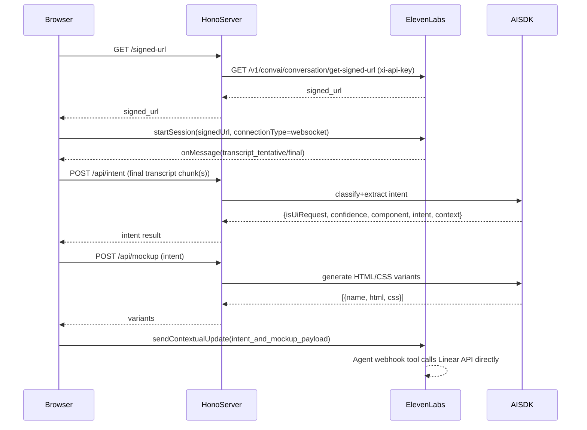

# Voice_to_mockup_plan

## Goals

- **Realtime transcript in UI** using ElevenLabs Agents Platform React SDK (browser connects to ElevenLabs directly).
- **Server-side “intelligence”** (intent detection + mockup HTML/CSS generation) via **AI SDK** in `server/`.
- **Ticket queue + export to Linear** via an **ElevenLabs Agent webhook tool** (Linear API calls are not made by our backend).
- Keep keys safe: **ElevenLabs API key never goes to browser**; browser requests a short-lived signed URL from our backend, per ElevenLabs docs ([React SDK auth section](https://elevenlabs.io/docs/agents-platform/libraries/react)).

## High-level architecture

## Implementation plan (by subsystem)

### 1) ElevenLabs Agents Platform: transcript streaming in the browser

**Approach**

- Use `@elevenlabs/react` `useConversation()` to manage mic + connection.
- Authenticate by fetching a **signed URL** from our Hono backend, then call:
  - `conversation.startSession({ signedUrl, connectionType: 'websocket', userId })`
- Drive UI state from callbacks:
  - `onStatusChange` → connection status for `CallPanel`
  - `onModeChange` / `isSpeaking` → listening indicator
  - `onMessage` → append transcript events into `TranscriptFeed`

**Files to add/update (client)**

- Add `@elevenlabs/react` usage in a new hook:
  - [`client/src/hooks/useConversationTranscription.ts`](/Users/danielkumlin/Projects/oncall/client/src/hooks/useConversationTranscription.ts)
- Update API client helper (if needed) to call the new backend auth route:
  - [`client/src/lib/api.ts`](/Users/danielkumlin/Projects/oncall/client/src/lib/api.ts)

**Backend auth route**

- Implement `GET /signed-url` in Hono.
  - Calls ElevenLabs REST API to fetch signed URL using `xi-api-key` header.
  - Returns plain text `signed_url`.

**Files to add/update (server)**

- Add route handler(s) in existing entrypoint:
  - [`server/src/index.ts`](/Users/danielkumlin/Projects/oncall/server/src/index.ts)
- Add a small service wrapper:
  - [`server/src/services/elevenlabs.ts`](/Users/danielkumlin/Projects/oncall/server/src/services/elevenlabs.ts)

**Env vars**

- `ELEVENLABS_API_KEY`
- `ELEVENLABS_AGENT_ID`
- Optional: `ELEVENLABS_SERVER_LOCATION` (if you want residency controls)

### 2) Intent detection (server-side via AI SDK)

**Approach**

- Trigger intent detection in the client only on **final** transcript updates (debounce 500–1500ms).
- POST the most recent rolling window (e.g., last 1–3 utterances) to backend.
- Backend uses AI SDK to return structured JSON:
  - `isUiRequest: boolean`
  - `confidence: number (0-1)`
  - `component: string | null`
  - `intent: string | null`
  - `context: string | null`
  - `reasoningShort: string | null` (optional)
- Client highlights “detected” items in `TranscriptFeed` and can add them to `TicketQueue`.

**Files to add (server)**

- [`server/src/services/intentDetector.ts`](/Users/danielkumlin/Projects/oncall/server/src/services/intentDetector.ts)
- Add endpoint in [`server/src/index.ts`](/Users/danielkumlin/Projects/oncall/server/src/index.ts):
  - `POST /api/intent`

**AI SDK provider**

- Use AI SDK in `server/` (as you stated).
- The plan assumes you’ll configure whichever provider you’re already using with AI SDK (keys via env).

### 3) Mockup generation (server-side via AI SDK, render in iframe)

**Approach**

- Backend endpoint `POST /api/mockup` accepts extracted intent + a small optional context payload (brand colors, current page name, etc.).
- AI SDK returns **1–2 variants**:
  - Each variant contains `html` and `css` (or a single HTML string with inline CSS).
- Client renders variants via `iframe srcDoc` (or a sandboxed iframe) in `MockupPreview`.
- Keep mockups “static” (no external JS) for safety and predictable rendering.

**Files to add**

- Server:
  - [`server/src/services/mockupGenerator.ts`](/Users/danielkumlin/Projects/oncall/server/src/services/mockupGenerator.ts)
  - Endpoint in [`server/src/index.ts`](/Users/danielkumlin/Projects/oncall/server/src/index.ts):
    - `POST /api/mockup`
- Client:
  - [`client/src/components/MockupPreview.tsx`](/Users/danielkumlin/Projects/oncall/client/src/components/MockupPreview.tsx)

### 4) Frontend UI composition and state

**Components**

- [`client/src/components/CallPanel.tsx`](/Users/danielkumlin/Projects/oncall/client/src/components/CallPanel.tsx)
- [`client/src/components/TranscriptFeed.tsx`](/Users/danielkumlin/Projects/oncall/client/src/components/TranscriptFeed.tsx)
- [`client/src/components/TicketQueue.tsx`](/Users/danielkumlin/Projects/oncall/client/src/components/TicketQueue.tsx)

**App wiring**

- Update [`client/src/App.tsx`](/Users/danielkumlin/Projects/oncall/client/src/App.tsx) to match the layout you outlined.
- Maintain a minimal local store:
  - `transcriptEvents[]`
  - `detectedIntents[]`
  - `tickets[]` (queued requirements)
  - `selectedMockupByTicketId`

### 5) Linear integration (via ElevenLabs Agent webhook tool)

**Approach**

- Configure an ElevenLabs Agent webhook tool that **calls Linear directly** (Linear auth/secret stored/configured in the tool inside ElevenLabs).
- The app keeps the agent up to date by sending structured context (via `sendContextualUpdate`) containing:
  - Title (derived from intent)
  - Description (transcript quote + timestamp + chosen mockup HTML/CSS)
  - Labels (e.g. `client-feedback`, `ui`)

**What we implement in code**

- Client: automatically (or on key state changes) sends the payload to the agent via `sendContextualUpdate`.
- Agent prompt/tooling (in ElevenLabs UI): ensure the agent knows when to call the webhook tool and the expected payload schema.

## API surface (final)

- `GET /signed-url` → returns ElevenLabs signed WebSocket URL (plain text)
- `POST /api/intent` → returns intent JSON
- `POST /api/mockup` → returns mockup variants (HTML/CSS)
- No server Linear endpoint: Linear is created by the agent webhook tool.

Notes:

- Client already proxies `/api/*` to the server via Vite config, rewriting `/api` away. For simplicity, keep:
  - `/signed-url` as a non-proxied call (direct to `http://localhost:3000/signed-url`) OR add it under `/api/signed-url` so it goes through the existing proxy.
  - In this plan, we’ll standardize to `/api/signed-url` so the client can always call relative paths.

## Risks & guardrails

- **Transcript event shape**: `onMessage` payload types may include debug/agent replies; we’ll filter to user transcript events.
- **Prompt robustness**: use strict JSON schema + Zod parsing server-side to avoid UI breaking on malformed LLM output.
- **Security**: never ship `ELEVENLABS_API_KEY` to client; use signed URL flow as in docs ([React SDK auth example](https://elevenlabs.io/docs/agents-platform/libraries/react)).